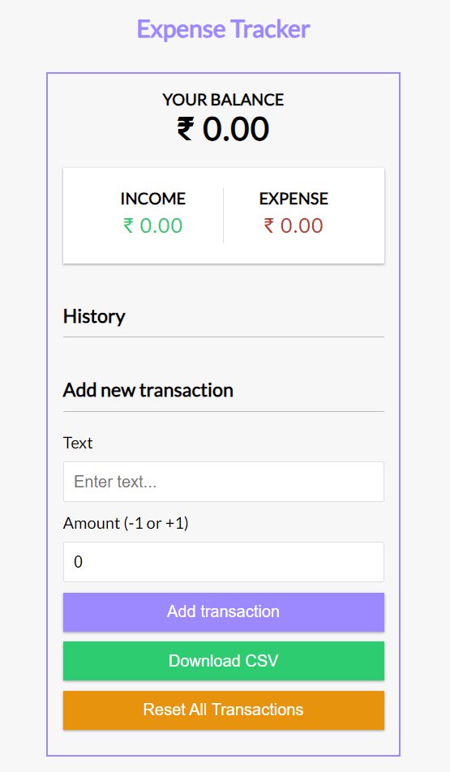

# Expense Tracker

A simple and intuitive expense tracker application built with React. This app allows users to add, delete, and view their transactions, as well as download their transaction data as a CSV file.

## Features

- **Add Transactions:** Input transaction details with a description and amount.
- **Delete Transactions:** Remove transactions from the list.
- **View Balance:** See the total balance calculated from all transactions.
- **Export Data:** Download transactions as a CSV file.
- **Sequential IDs:** Transactions are automatically assigned unique sequential IDs.

## Installation

   ```bash
    git clone https://github.com/Sanjaykumar-rengaraju/ExpenseTracker.git
    cd ExpenseTracker

    npm install

    npm run dev
   ```

